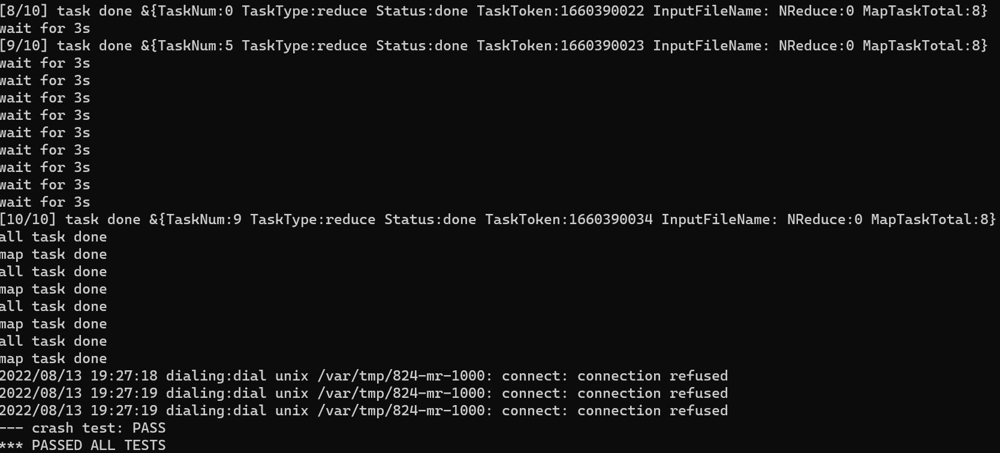
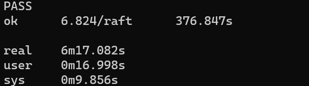
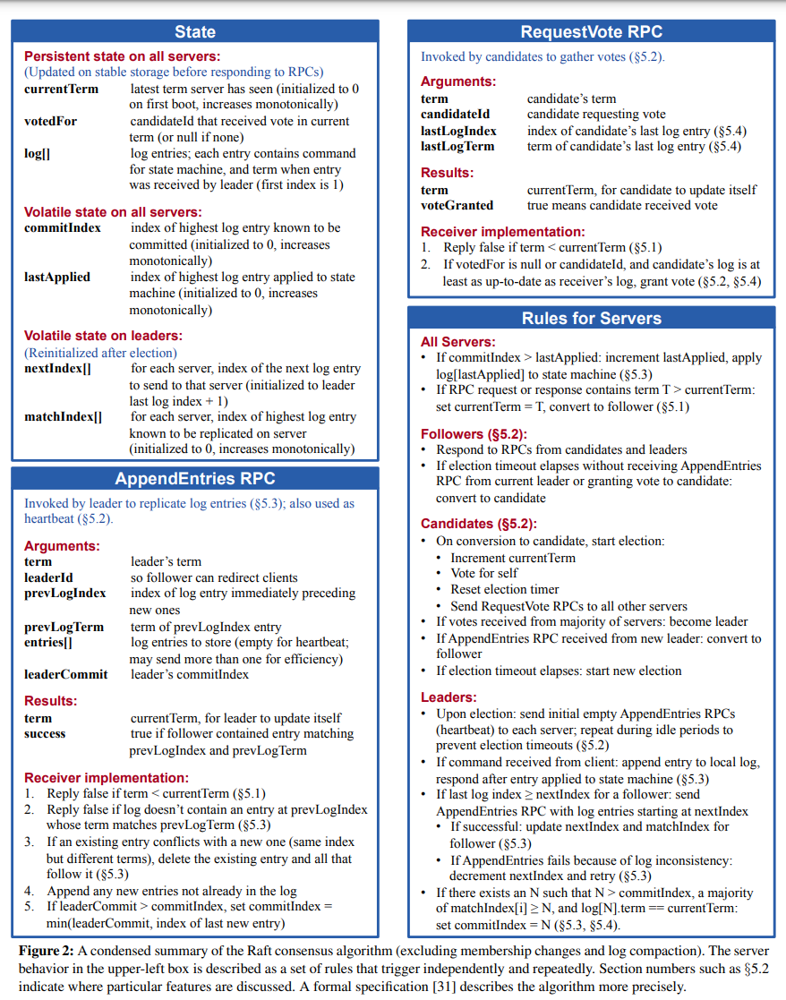
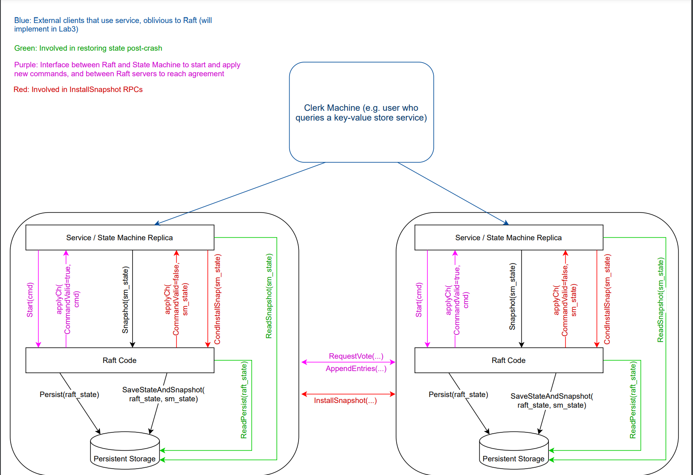
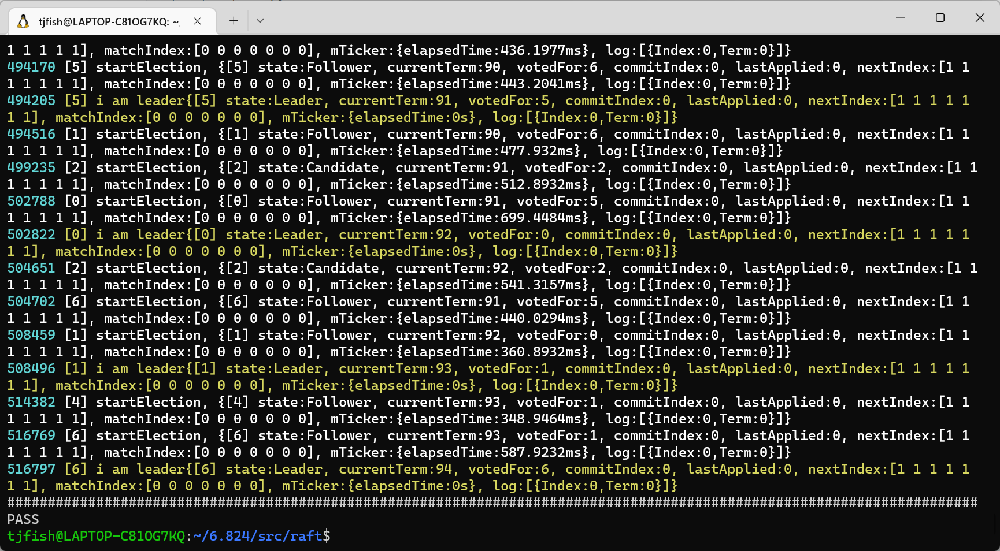
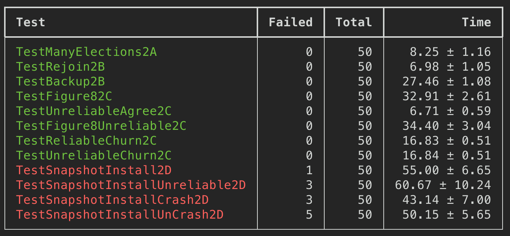
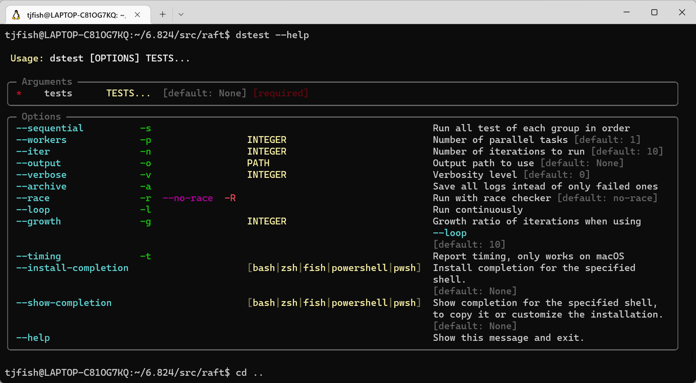
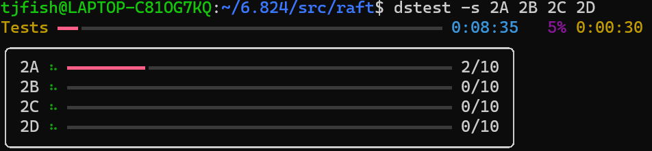
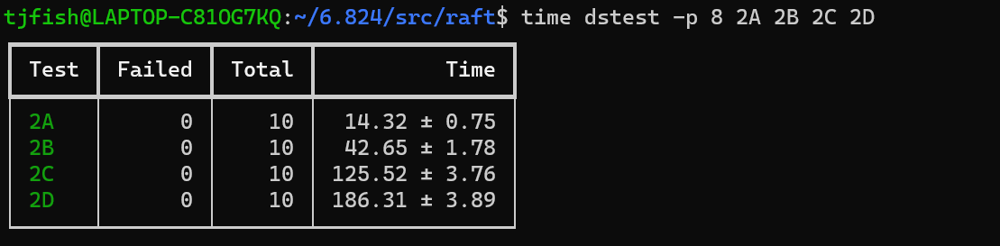

# MIT [6.824](https://pdos.csail.mit.edu/6.824/index.html) : Spring 2022

MIT 6.824 2022分布式系统 课程代码实现

- [x] lab1 MR
- [x] lab2 Raft
  - [x] 2A leader election
  - [x] 2B log 
  - [x] 2C persistence 
  - [x] 2D log compaction
- [ ]  lab3 kvraft
- [ ] lab4 shardkv

## Lab1 MapReduce的实现

实现思路参考我的博客：[分布式MapReduce实现](/分布式MapReduce)

测试结果



## Lab2 Raft 代码设计与实现

测试结果



参考资料

- [Raft论文](https://raft.github.io/raft.pdf)

- [Raft协议详解 - 丁凯的文章 - 知乎]( https://zhuanlan.zhihu.com/p/27207160)
- [Students' Guide to Raft](https://thesquareplanet.com/blog/students-guide-to-raft/)
- [Lab guidance](https://pdos.csail.mit.edu/6.824/labs/guidance.html)
- [yzongyue](https://github.com/yzongyue)/**[6.824-golabs-2020](https://github.com/yzongyue/6.824-golabs-2020)**

Figure2 镇楼



代码整体交互流程




### 多线程编程

所有修改状态的操作前，都需要先检查当前状态是否满足修改条件。或者说，修改状态应该在当前线程完成，不能委托给其他线程。

- 常见的模式一（互斥锁）：

  - 获取状态锁
  - 判断修改条件是否满足
  - 修改状态
  - 释放锁

- 常见的模式二（条件等待）：

  - 获取状态锁
  - 循环检查条件，不满足则释放锁，等待被唤醒Cond.Wait()
  - 被唤醒，循环检查条件是否满足
    - 满足，跳出循环
    - 不满足，继续循环
  - 修改状态
  - 释放锁

- 一个不容易发现的错误模式

  - 首先获取状态锁
  - 判断修改条件满足后
  - **启动新线程**去修改状态
  - 释放锁

  这有并发性问题，因为新线程启动去修改状态时，可能当前状态已经被其他线程修改，原先的修改条件已经不满足。

### RPC消息线程代码实现模式

Raft实现中，需要发送AppendEntries 和 RequestVote 两类RPC消息。在【Lab2D】，还需要实现Install Snapshot RPC消息。这些消息如何发送和接收处理，是代码实现最核心也是最困难的部分，许多Bug都隐藏在这里。

这里介绍下我总结的统一RPC消息线程的代码实现模式，供大家参考。

由于发送消息会阻塞本线程（需要等待消息回复），因此一般需要在一个新线程中发送消息。同时MIT的老师建议：在接收消息回复后直接在本线程中进行处理，最好不要将消息回复传递给其他线程处理。

因此RPC消息的基本实现模式是，在同一个线程内：

1. 获取锁
2. 生成RPC消息参数
3. 释放锁（因为发送RPC消息会导致线程阻塞，需要释放锁）
4. 发送RPC消息，等待消息回复
5. 再次获取锁

6. 处理消息回复
7. 释放锁

再考虑何时触发`发送RPC消息`，即消息发送条件，这有两种选择

**全部实现在一个线程中**：在RPC消息线程中加入循环检查，判断是否满足消息发送条件，一旦满足条件则发送RPC消息，代码流程如下：

1. 获取锁
2. 判断RPC消息发送条件是否满足
3. 生成RPC消息参数
4. 释放锁
5. 发送RPC消息，等待消息回复
6. 再次获取锁
7. 处理消息回复
8. 释放锁
9. 循环

**检查线程和工作线程**分工合作：吧循环检查的任务交给另外一个线程，该线程循环检查发送条件，一旦满足条件则新启动一个RPC消息线程发送消息，代码流程如下：

- 条件检查线程
  1. 获取锁
  2. 判断RPC消息发送条件是否满足
  3. 生成RPC消息参数
  4. 启动RPC消息线程
  5. 释放锁
  6. 循环

- RPC消息线程
  1. 发送RPC消息
  2. 等待消息回复
  3. 获取锁
  4. 处理消息回复
  5. 释放锁

采用第一种方案的好处是可以避免多线程交互，虽然看上去似乎简单直接，但实际实现起来很容易猪脑过载，因为在一个线程内塞进去了大量逻辑和条件判断语句，整个代码非常不好理解。之后调试已经增加新的逻辑时很痛苦。

第二种方案将职责进行了分离，代码实现起来相对比较简单。但引入了多个线程，需要格外考虑线程交互的问题。

思考：当RPC消息线程被调度工作时，有可能此时消息发送条件已经不满足了，该怎么办？

> 这并不会有问题，因为Raft协议是支持处理过期消息的（前提是**消息本身是正确**的）。即使发送消息时条件已经不满足，接收方也能判断出消息已经过期，忽略此消息。从另外一个角度想，消息在网络中传递也需要时间，由于网络波动，即使消息发出时是有效的，消息抵达时也可能已经过期。所以无论检查多少次发送条件都没有意义，消息都有可能过期。
>
> 所以，只要保证消息本身是正确的，这意味着在条件检查线程中生成`RPC消息参数`，交由RPC消息线程。RPC消息线程不再检查是否满足条件，直接发送消息。切忌不可在RPC消息线程内生成消息参数，如果要这么做就需要再次检查消息发送条件，但这就退化成了第一种方案。
>
> 同时这也提醒我们在代码实现时，需要格外注意，过期的消息，重复的消息，乱序的消息。我们的代码需要足够的鲁棒性能够处理这些错误。

### Log数据结构设计思路

论文中使用log数组顺序存放所有LogEntry，数组 index 从 1 开始。而在代码实现中，Go数组index 从 0开始。直接Go数组存放log会带来两个问题：

- 代码中充斥大量的index转换逻辑，如log index = array index + 1， array index = log index -1，很容易把人给弄晕，而往往bug就是隐藏在这 加一，减一的逻辑中（血的教训~~~）。
- log数组有可能为空（这是正常的，比如刚启动时）。然而Raft中许多逻辑都依赖于log的状态，需要从log数组取值，比如最新的log(last log)。这导致代码中需要大量if else的判断语句来处理log数组为空的情况，称为特殊逻辑。

针对这两个问题，设计数据结构LogCache将日志的逻辑都封装起来，整体设计思路如下：

- 内置index转换：LogCache只接收log index，内部封装log index 与 array index的转换逻辑。
- 数组永远不为空：初始化时，在数组 index=0 的位置存入临界值（index=0，Term=0）这样使用统一的代码就可以处理数组为空的情况。
- 提供语义接口：提供更高语义的接口，封装重复且复杂的数组操作。外部不能直接访问底层数组，提高代码可读性。
  - get(index): 获取log index = index 的日志
  - after(index): 获取log index> index的所有日志。
  - last(): 获取最后一条日志。

此外，在【Lab2D】中，将会删除已保存的日志。LogCache可以很好兼容，将array index与 log index的偏移从 1 变为 lastIncludeIndex即可。

### 注意事项

有且只有三个情况需要重置timer，其他情况不要重置timer

- 收到AppendEntries RPC消息，且消息未过期
- 开始选举时
- 投票给其他Candidate时
- 【Lab2D新增】收到Install Snapshot RPC消息（原因类似于AppendEntries RPC）

注意避免死锁

- 在获取锁后一定记得释放锁

- 建议在函数进入时获取锁，使用defer语句在函数返回前释放锁。

【Lab2D】需要实现对Raft状态的快照（snapshot)，具体有以下几个需求

- 实现Snapshot()保存快照，删除内存多余的log。
- 实现InstallSnapshot RPC，当leader发现内存中log不足以同步follower时，使用快照同步状态。follower接收到快照时，能够根据快照恢复状态，并且删除过期log。
- 奔溃重启时，从保存快照恢复状态机，从保存的Raft State恢复Raft数据。

## 可视化日志调试设置

[这篇文章](https://blog.josejg.com/debugging-pretty/)介绍了如何设置可视化日志。由于分布式系统开发调试起来非常困难，打印的日志太多眼睛都看花，因此很有必要整理下日志输出，设置可视化界面来帮助分析找bug。

最终效果：



### go代码改动

在src/raft/util.go 下加入以下代码

```go
const debug = true
type logTopic string

const (
	dClient  logTopic = "CLNT"
	dCommit  logTopic = "CMIT"
	dDrop    logTopic = "DROP"
	dError   logTopic = "ERRO"
	dInfo    logTopic = "INFO"
	dLeader  logTopic = "LEAD"
	dLog     logTopic = "LOG1"
	dLog2    logTopic = "LOG2"
	dPersist logTopic = "PERS"
	dSnap    logTopic = "SNAP"
	dTerm    logTopic = "TERM"
	dTest    logTopic = "TEST"
	dTimer   logTopic = "TIMR"
	dTrace   logTopic = "TRCE"
	dVote    logTopic = "VOTE"
	dWarn    logTopic = "WARN"
)

// Retrieve the verbosity level from an environment variable
func getVerbosity() int {
	v := os.Getenv("VERBOSE")
	level := 0
	if v != "" {
		var err error
		level, err = strconv.Atoi(v)
		if err != nil {
			log.Fatalf("Invalid verbosity %v", v)
		}
	}
	return level
}

var debugStart time.Time
var debugVerbosity int

func init() {
	debugVerbosity = getVerbosity()
	debugStart = time.Now()

	log.SetFlags(log.Flags() &^ (log.Ldate | log.Ltime))
}

func Debug(topic logTopic, format string, a ...interface{}) {
	if debug {
		time := time.Since(debugStart).Microseconds()
		time /= 100
		prefix := fmt.Sprintf("%06d %v ", time, string(topic))
		format = prefix + format
		log.Printf(format, a...)
	}
}
```

在你想要打印日志的地方调用Debug函数，比如在初始化raft的make函数中加入

```go
func Make(peers []*labrpc.ClientEnd, me int,
	//....
	go rf.ticker()

	Debug(dInfo, "Make: %d", rf.me) // 加入日志打印函数
          
	return rf
}
```

### python脚本设置

首先安装python和pip

```
sudo apt-get install python3
sudo apt-get install python3-pip
```

然后安装python脚本所需依赖

```
pip install typer
pip install rich
```

下载脚本，将脚本设置为可执行

```
wget https://gist.github.com/JJGO/e64c0e8aedb5d464b5f79d3b12197338

chmod +x dslogs
```

注意，如果本地只有python3环境，需要修改脚本第一行

```
#!/usr/bin/env python
改为->
#!/usr/bin/env python3
```

将脚本加入环境变量

```
sudo vi /etc/profile
# 将这行加在文件最后，记得替换地址
export PATH=$PATH:/daslogs文件所在地址/

source /etc/profile
```

测试下效果

```
cd src/raft

VERBOSE=1 go test -run InitialElection | dslogs
```

效果如下


## 批量测试脚本设置

批量测试脚本可以帮我们并行，重复跑多个测试。

效果如下：



下载脚本并设置可执行

```
cd /项目地址

wget https://gist.githubusercontent.com/JJGO/0d73540ef7cc2f066cb535156b7cbdab/raw/079a847924bcb538cb9336d381961ce608ac1244/dstest

chmod +x dstest
```

注意，如果本地只有python3环境，需要修改脚本第一行

```
#!/usr/bin/env python
改为->
#!/usr/bin/env python3
```

查看使用手册

```
dstest --help
```

测试下

```
cd src/raft

dstest InitialElection
```

效果如下








